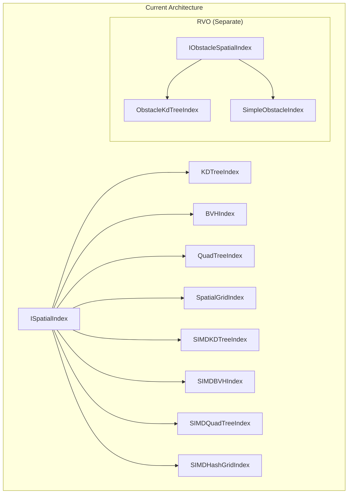

# Design: Refactor Spatial Index

## Architecture Context



## Issue 1: RVO Obstacle Index - Decision Analysis

### Option A: Generic Abstraction

**Pros:**
- Maximum code reuse (one KDTree for both points and segments)
- Type-safe at compile time
- Clear separation of concerns

**Cons:**
- Significant refactoring effort (8 implementations)
- Generic constraint complexity (`where TElement : struct`)
- RVO's segment-splitting KdTree cannot be generalized (it's RVO-specific)
- Performance overhead from virtual dispatch on distance calculations

**Estimated Effort:** 3-4 days

### Option B: Keep Separate Interfaces (Recommended)

**Pros:**
- Minimal disruption to working code
- Preserves RVO's optimized segment-splitting KdTree
- Clear domain boundary (agents vs obstacles)
- Easier to maintain independently

**Cons:**
- Some code duplication (tree traversal patterns)
- Two interfaces to understand

**Estimated Effort:** 0.5 days (just reorganization)

### Recommendation: Option B

The RVO obstacle KdTree is fundamentally different:
1. It **splits line segments** during construction (points can't be split)
2. It uses **one-sided queries** (only agents to the right of obstacle edges are affected)
3. It always returns **all obstacles sorted** (no K-limit)

These are RVO-specific behaviors that don't generalize to point-based spatial indexing.

**Proposed Directory Structure:**
```
Core/Spatial/
├── ISpatialIndex.cs              # Point-based interface
├── SpatialIndexManager.cs
├── Unit.cs
├── Default/                      # Point implementations
│   ├── KDTreeIndex.cs
│   ├── BVHIndex.cs
│   ├── QuadTreeIndex.cs
│   └── SpatialGridIndex.cs
├── SIMD/                         # SIMD point implementations
│   ├── SIMDKDTreeIndex.cs
│   ├── SIMDBVHIndex.cs
│   ├── SIMDQuadTreeIndex.cs
│   └── SIMDHashGridIndex.cs
└── Segment/                      # Segment-based (for RVO obstacles)
    ├── ISegmentSpatialIndex.cs   # Renamed from IObstacleSpatialIndex
    ├── SegmentKdTreeIndex.cs     # Renamed from ObstacleKdTreeIndex
    └── SegmentLinearIndex.cs     # Renamed from SimpleObstacleIndex
```

## Issue 2: QueryKNearest Performance - Technical Design

### Current Problem

All implementations do:
```csharp
void QueryKNearest(Vector2 pos, int k, List<int> results) {
    QueryKNearestSorted(pos, k, float.MaxValue, results); // Always sorts!
}
```

The `QueryKNearestSorted` internal implementations maintain a **sorted candidate list** via insertion sort, which is O(k) per insertion.

### Solution: Separate Search Strategies

**For QueryKNearest (unsorted):**
- Use a max-heap (priority queue) for K-nearest candidates
- When heap is full and new candidate is closer than max, remove max and insert new
- Return heap contents in arbitrary order
- Complexity: O(N log K) for search + O(K) for extraction

**For QueryKNearestSorted (sorted):**
- Call QueryKNearest first
- Then sort the K results by distance
- Complexity: O(N log K) + O(K log K)

### Implementation Pattern

```csharp
// Shared candidate management
private struct Candidate {
    public int Index;
    public float DistSq;
}

// For QueryKNearest: Use max-heap
private void AddCandidateUnsorted(int index, float distSq, int k, List<Candidate> heap) {
    if (heap.Count < k) {
        heap.Add(new Candidate { Index = index, DistSq = distSq });
        HeapPushUp(heap, heap.Count - 1);
    } else if (distSq < heap[0].DistSq) {  // Compare with max (root of max-heap)
        heap[0] = new Candidate { Index = index, DistSq = distSq };
        HeapPushDown(heap, 0);
    }
}

// For QueryKNearestSorted: Use insertion sort (current behavior)
private void AddCandidateSorted(int index, float distSq, int k, List<Candidate> sorted) {
    // Current implementation - insertion sort
}
```

### Files to Modify

| File | Change |
|------|--------|
| `KDTreeIndex.cs` | Add `QueryKNearestUnsorted` path |
| `BVHIndex.cs` | Add `QueryKNearestUnsorted` path |
| `QuadTreeIndex.cs` | Add `QueryKNearestUnsorted` path |
| `SpatialGridIndex.cs` | Skip final sort in `QueryKNearest` |
| `SIMDKDTreeIndex.cs` | Modify Burst function for unsorted |
| `SIMDBVHIndex.cs` | Modify Burst function for unsorted |
| `SIMDQuadTreeIndex.cs` | Modify Burst function for unsorted |
| `SIMDHashGridIndex.cs` | Modify Burst function for unsorted |

### Performance Impact

**Before (K=10, N=500 agents):**
- QueryKNearest: ~50 insertion sorts during search + always sorted output

**After (K=10, N=500 agents):**
- QueryKNearest: ~50 heap operations (faster) + no sorting
- QueryKNearestSorted: ~50 heap operations + 1 sort of 10 elements

**Expected Improvement:** 10-20% faster for unsorted queries (common in RVO neighbor finding).

## Verification Strategy

1. **Unit Tests:** Verify QueryKNearest returns correct K elements (any order)
2. **Equivalence Tests:** Verify sorting QueryKNearest results equals QueryKNearestSorted results
3. **Performance Benchmarks:** Compare old vs new implementation timing
4. **Integration Tests:** Run existing RVO demos and verify behavior unchanged
