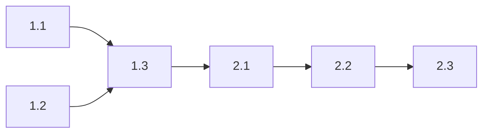

# Tasks: Refactor Spatial Index

## Phase 1: Fix QueryKNearest Performance (Priority: High)

### 1.1 Default Implementations
- [x] **KDTreeIndex.cs**: Implement unsorted KNN using max-heap pattern
  - Add heap-based candidate management for `QueryKNearest`
  - Keep sorted insertion for `QueryKNearestSorted`
  - Verify no behavior change in existing callers

- [x] **BVHIndex.cs**: Implement unsorted KNN
  - Same pattern as KDTreeIndex
  - Test with visual demo

- [x] **QuadTreeIndex.cs**: Implement unsorted KNN
  - Same pattern as KDTreeIndex
  - Verify bucket traversal still works correctly

- [x] **SpatialGridIndex.cs**: Skip sorting in QueryKNearest
  - Modify ring expansion to collect candidates without sorting
  - Sort only in `QueryKNearestSorted`

### 1.2 SIMD Implementations
- [x] **SIMDKDTreeIndex.cs**: Modify Burst function for unsorted search
  - Update `QueryKNearestBurst` to use `sortResults` parameter
  - `QueryKNearest` calls with `sortResults=false`
  - `QueryKNearestSorted` calls with `sortResults=true`

- [x] **SIMDBVHIndex.cs**: Same modifications as SIMD KDTree

- [x] **SIMDQuadTreeIndex.cs**: Same modifications as SIMD KDTree
  - Added `QueryKNearestBurstExt` with `sortResults` parameter
  - Added `AddCandidateUnsorted` for heap-based collection

- [x] **SIMDHashGridIndex.cs**: Same modifications as SpatialGridIndex
  - Added `sortResults` parameter to Burst function
  - Added `FindKthSmallest` for early termination check

### 1.3 Verification
- [x] Run SurvivorDemo and RVO2Demo to verify integration
  - User confirmed compilation passes after reference fix

## Phase 2: Reorganize RVO Obstacle Index (Priority: Medium)

### 2.1 Move and Rename Files
- [x] Create `Core/Spatial/Segment/` directory
- [x] Move `IObstacleSpatialIndex.cs` → `ISegmentSpatialIndex.cs`
- [x] Move `ObstacleKdTreeIndex.cs` → `SegmentKdTreeIndex.cs`
- [x] Move `SimpleObstacleIndex.cs` → `SegmentLinearIndex.cs`

### 2.2 Update References
- [x] Update `RVOSimulator.cs` to use new interface/class names
- [x] Verified `SIMDRVOSimulator.cs` does not reference obstacle index directly
- [x] No other files referencing old paths

### 2.3 Cleanup
- [x] Delete old `Core/RVO/Spatial/` directory
- [x] Verify project compiles

## Dependencies

## Completion Summary

| Phase | Status | Actual Effort |
|-------|--------|---------------|
| 1.1 Default Implementations | ✅ Complete | ~1.5 hours |
| 1.2 SIMD Implementations | ✅ Complete | ~1.5 hours |
| 1.3 Verification | ✅ Complete | User validation |
| 2.1 Move Files | ✅ Complete | 15 min |
| 2.2 Update References | ✅ Complete | 15 min |
| 2.3 Cleanup | ✅ Complete | 5 min |
| **Total** | **✅ Complete** | **~3.5 hours** |
